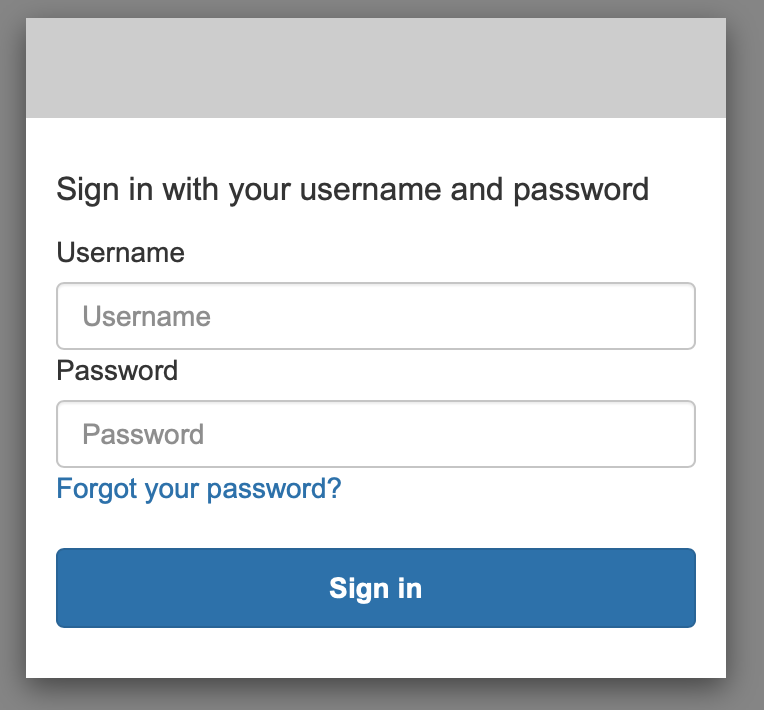
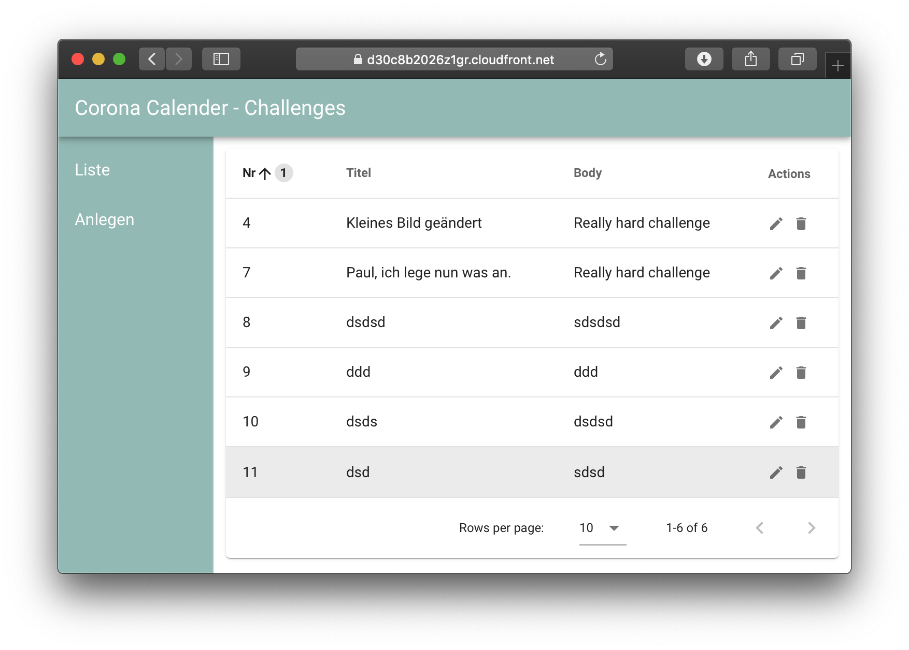
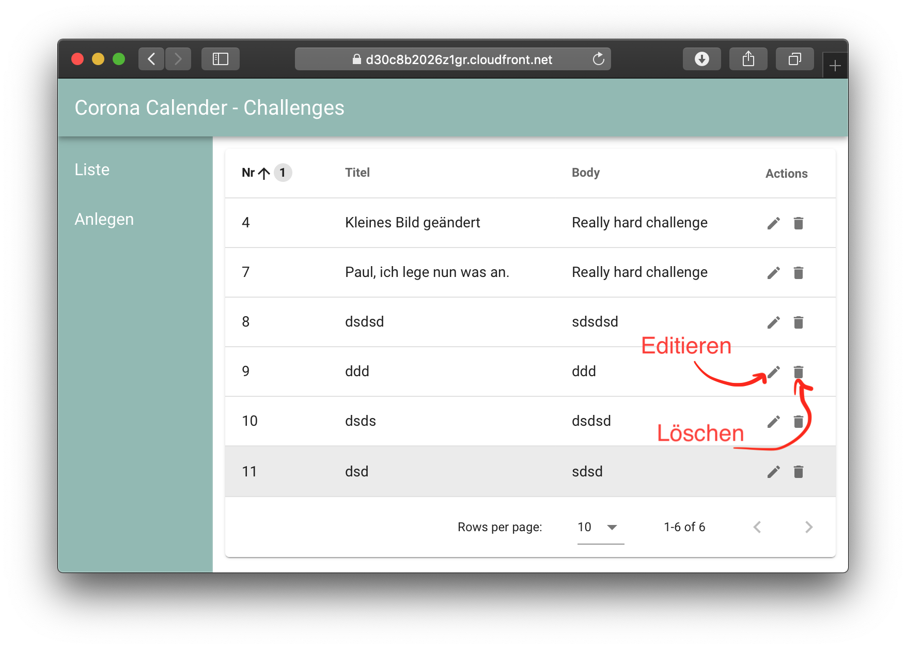
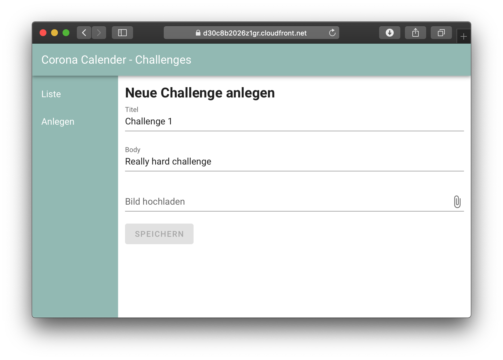
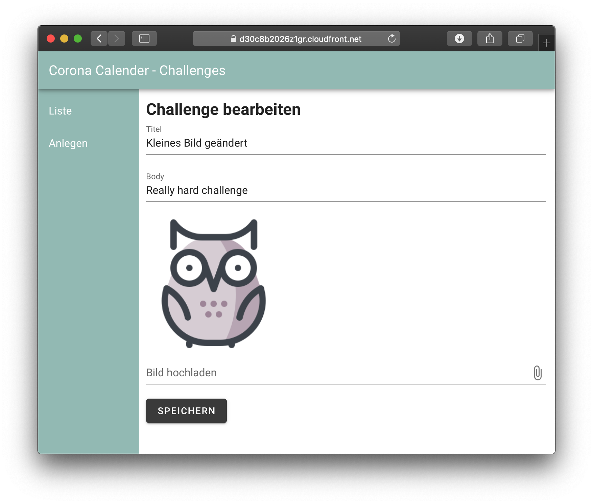

# Kurzanleitung - Admin Web App 'Corona Calender'

## Aufruf der Web App und Login

Nutzt bitte für den Aufruf der Web App *immer* folgenden Link:

https://corona-cal.auth.eu-west-1.amazoncognito.com/login?response_type=token&client_id=osupm9rc8kv7jpnhjdtsqu7vj&redirect_uri=https://d30c8b2026z1gr.cloudfront.net

Sieht sperrig aus, stellt aber sicher das ihr richtig eingeloggt werden. Speichert euch bitte einfach ein Bookmark im Browser(z.B. mit *STRG+D*), dann spielt die URL eine untergeordnete Rolle.

Ihr sollte bei Aufruf des obigen Links folgenden Login Screen sehen:

Aktuell haben wir einen gemeinsamen Nutzer für alle:

* Username: *input.user*
* Password: *Imf#123!*

## Web App

Nach erfolgreichem Login solltet ihr folgende Seite sehen:

Das ist die Listenansicht alle anlegten Challenges. Die Tabelle ist nach der Reihenfolge der Challenges sortiert. 

Innerhalb der Tabelle können Challenges bearbeitet und gelöscht werden.

## Neue Challenges anlegen

Um eine neue Challenge anzulegen klickt *Anlegen* in der Seitennavigationsleiste. Folgender Screen sollte zu sehen sein.

Alle Felder sind Pflichtfelder. Bilder sind im *.png* Format hochzuladen.

## Editieren

Um eine Challenge zu bearbeiten klickt den Stift in der *Liste* Ansicht. Folgener Scree sollte zu sehen sein.

Beachtet bitte das es aktuell nicht Möglich ist die Reihenfolge der Challenges nachträglich zu bearbeiten. Auch nach dem erfolgreichen Anpassen behält die Challenge ihr *Reihenfolgenummer (Erste Spalte in der Listenansicht)*.

